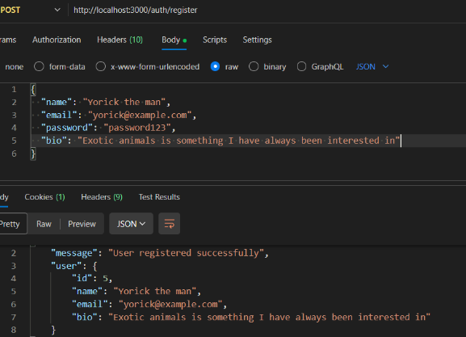

# 🐾 RareKind – Backend API

RareKind is a backend **Express.js** API that powers a platform where users can showcase their exotic animals and browse collections created by others.  
This repository pairs with the [**RareKind Frontend**](https://github.com/technative-academy/rarekind-frontend). **API documentation** is available [here](https://rarekind-backend-production.up.railway.app/api-docs/).

The backend is deployed on **Railway**, uses **MySQL**, and integrates **Cloudinary** for image hosting.

---

## 📝 Overview

RareKind provides a complete API for:

- User authentication
- Creating and managing collections
- Adding animals into collections
- Retrieving collections including full animal objects
- Image upload support via Cloudinary

The database schema was collaboratively designed using
**dbdiagram.io**


and visualised using **MySQL Workbench**.


---

## 🛠️ Installation Guide

### 📌 Prerequisites

Make sure you have the following installed on your system:

- **Node.js** (v18 or higher)
- **npm** (v6 or higher)
- **MySQL** (v8 or higher)
- **MySQL Workbench** (optional, for visual DB inspection)

---

### 📦 Install Dependencies

```bash
npm install
```

### Environmental Variables

Create a .env file in the root of your project.
Below is the exact format required for this application:

```bash
JWT_SECRET=
REFRESH_SECRET=

MYSQL_HOST=
MYSQL_PORT=53093
MYSQL_USER=root
MYSQL_PASSWORD=
MYSQL_DATABASE=railway

CORS_ORIGIN=
```

### 🗄️ Database Setup

SQL for creating the database

- [Script]()

### 🚀 Running the Server

To start the backend:

```bash
npm start
```

### 🔍 Testing the Endpoints

Once the server is running, you can test routes using Postman

## 🖥️ Features

### 👤 Authentication

- User registration
- Login with JWT
- Hashed passwords (bcrypt)

### 📁 Collections

- Full CRUD operations
- Each collection automatically includes its animals

### 🐍 Animals

- Add animals to a collection
- Retrieve all animals in a specific collection
- Includes classification, description, and Cloudinary image URLs
- Frontend receives full objects

### 🌐 Project Workflow

- MySQL database hosted on Railway
- Backend deployed via Railway
- Schema drafted in dbdiagram.io
- Database visualised in MySQL Workbench

---

## 🎨 Architecture

RareKind follows a clean and scalable Express.js structure:

- **Models** — handle SQL queries
- **Controllers** — business logic
- **Routes** — API endpoints
- **Middleware** — JWT validation, error handling
- **Cloudinary integration** — secure image uploads

---

## ⚙️ Technologies Used

### Backend Core

- Node.js
- Express.js
- mysql2
- dotenv
- cors
- cookie-parser

### Authentication & Security

- jsonwebtoken
- bcryptjs

### Media Handling

- Cloudinary

---

## 🗄️ Database Design

### Tools Used

- dbdiagram.io
- MySQL Workbench

### Tables

- users
- collections
- animals
- classifications
- classification_animal

### SQL for creating the database

- [Script]()

---

## Testing

When testing endpoints we used an extension on VS code called Postman, The Screenshot below shows testing the endpoint /auth/register


## 🚀 Deployment

RareKind is deployed on Railway, featuring:

- Backend service
- MySQL production database
- Automatic builds and deploys
- Secure environment variables

---

## Documentation Update Checklist

Whenever we change database tables, models, controllers, or endpoints, update:

- Database schema /docs/rarekind_db
- models /src/models/
- controllers /src/controllers/
- routes /src/routes/
- API Documentation /docs/RareFind.yaml
- README endpoint Examples

## 🤝 Authors

### Backend

- [Yash Magane](https://github.com/YashMagane)
- [Yorick Brown](https://github.com/yodiyo)

### Frontend

- [Louise Aldridge](https://github.com/louiseka)
- [Matt Nightingale](https://github.com/MattNightingale)
